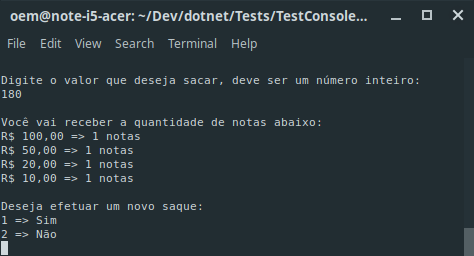

# CashMachine
Simule a entrega de notas quando um cliente efetuar um saque em um caixa eletrônico. Console Application em .Net Core

Os requisitos básicos são os seguintes:

Entregar o menor número de notas;
É possível sacar o valor solicitado com as notas disponíveis;
Saldo do cliente infinito;
Quantidade de notas infinito (pode-se colocar um valor finito de cédulas para aumentar a dificuldade do problema);
Notas disponíveis de 100,00, 50,00, 20,00 e 10,00 reais
Exemplos:

Valor do Saque: 30,00 reais – Resultado Esperado: Entregar 1 nota de 20,00, reais e 1 nota de 10,00 reais.
Valor do Saque: 80,00 reais – Resultado Esperado: Entregar 1 nota de 50,00 reais, 1 nota de 20,00 reais e 1 nota de 10,00 reais.

---
### Aplicação rodando no terminal


Para rodar o projeto é necessário:
-----------
* .net core 3.0

* Executar o comando a seguir no terminal dentro da pasta raíz do projeto para rodar a aplicação:
```
dotnet run
```